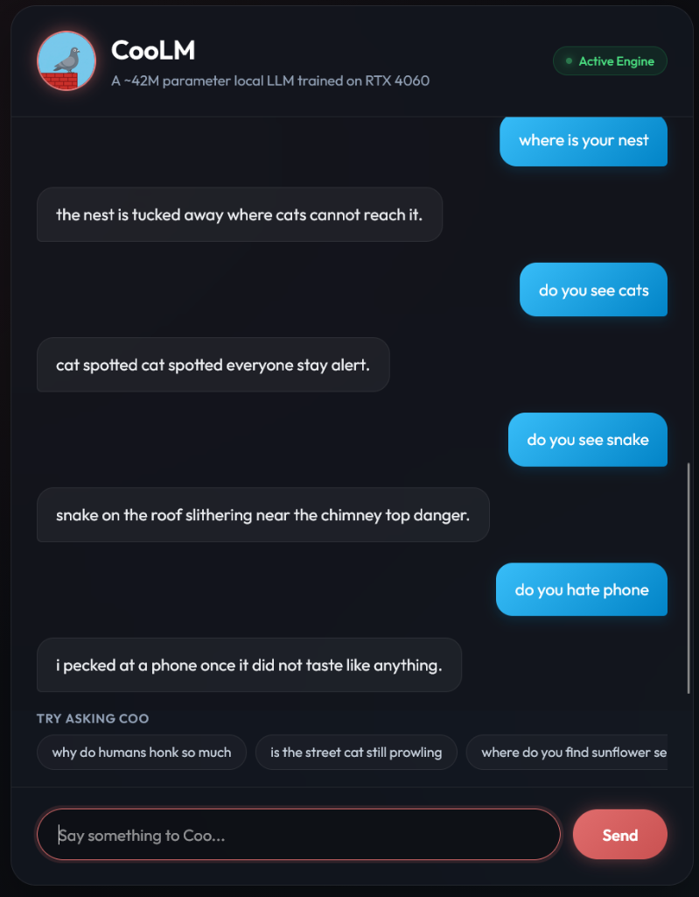
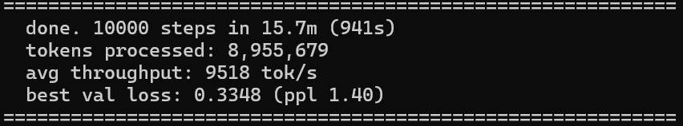

<p align="center">
  
</p>

<h1 align="center">CooLM</h1>
<p align="center"><em>A ~42M parameter LLM that talks like a rooftop pigeon.</em></p>

<p align="center">
  <a href="#"></a>&nbsp;
  <a href="https://huggingface.co/MdHussain121/coolm-42M"></a>&nbsp;
  <a href="LICENSE"></a>
</p>

---

> **This project exists to show that training your own language model is not magic.**
> No PhD required. No massive GPU cluster. One local machine, a few minutes, and you have a working LLM that you built from scratch — data generation, tokenizer, model architecture, training loop, and inference.
>
> It won't produce a billion-parameter model that writes essays. But it will show you exactly how every piece works — from raw text to trained weights to generated output — so the big models stop feeling like black boxes.

---



---

## What is CooLM?

CooLM is a tiny language model that pretends to be a pigeon named Coo. It speaks in short, lowercase sentences about rooftops, food, weather, and surviving in the city. It doesn't understand human abstractions like money, phones, or politics — and it's not trying to.

It's trained from scratch on 500K synthetic conversations across 13 topics, can be trained locally on a single GPU in 22 minutes, and produces a model small enough to run in a browser.

---

## Architecture

| | |
|---|---|
| **Parameters** | 41,476,480 |
| **Layers** | 8 |
| **Hidden dim** | 640 |
| **Heads** | 10 |
| **FFN** | 2560 (GeLU) |
| **Vocab** | 3,269 (BPE) |
| **Max sequence** | 64 tokens |
| **Norm** | LayerNorm |
| **Position** | Learned embeddings |
| **LM head** | Weight-tied with embeddings |

Vanilla decoder-only transformer. No GQA, no RoPE, no SwiGLU. As simple as it gets.

---

## Training Performance

This was my first time ever building a language model from scratch! The entire training process ran locally on a standard gaming laptop (**NVIDIA RTX 4060 Laptop GPU**) and completed in 22 minutes.

```text
================================================================================
done. 10000 steps in 22.0m (1322s)
tokens processed: 8,968,042
avg throughput: 6784 tok/s
best val loss: 0.3262 (ppl 1.39)
================================================================================
```



---

## Personality

Coo:
- Speaks in short, lowercase sentences with simple punctuation.
- Experiences the world through weather, rooftops, loud city sounds, and food.
- Doesn't understand human abstractions (alarms, jobs, money).
- Is observant, slightly anxious about threats, and always looking for a snack.

**13 topics:** birds, city_sounds, confused, emotions, flight, food, greetings, nesting, perch, rain, sleep, threats, weather.

---

## Quick Start

### Chat locally

You can run the entire pipeline or chat locally using the provided Windows batch files:

- **`train_coolm.bat`**: Installs requirements, generates the 500k dataset, prepares tokenizer/tensors, and trains the model.
- **`chat.bat`**: Spins up the optimized local Python web server. It prompts you to choose between the **Hugging Face version** (downloads and caches the pre-trained weights from `MdHussain121/coolm-42M` using a robust, built-in chunked downloader) or your own **local version**. It then automatically opens your browser to the beautiful dark mode UI.

#### Manual Step-by-Step Execution (No `.bat`)

If you prefer not to use the `.bat` files, you can execute the commands manually in your terminal:

1. **Install requirements**:
   ```bash
   pip install -r requirements.txt
   ```
2. **Generate dataset** (500k samples):
   ```bash
   python generate_data.py 500000
   ```
3. **Prepare and tokenize dataset**:
   ```bash
   python -m coolm.prepare_data pigeon_data.jsonl
   ```
4. **Train the model**:
   ```bash
   python -m coolm.train
   ```
5. **Export the trained model to ONNX**:
   ```bash
   python -m tools.model_export
   ```
6. **Run the local chat server**:
   ```bash
   python -m tools.server
   ```
   *The server will prompt you to choose between the Hugging Face version (Option 1) and your own local version (Option 2). Once selected, it automatically opens `http://localhost:8000/index.html` in your browser.*

---

## Dataset

| | |
|---|---|
| Samples | 500,000 (475K train / 25K val) |
| Format | `{"input": "...", "output": "...", "category": "..."}` |
| Categories | 13 |
| Generation | Synthetic template composition |

```python
import json
with open("pigeon_data.jsonl", "r") as f:
    print(json.loads(f.readline()))
# {'input': 'can you hear the rickshaw car horn', 'output': 'the rickshaw horns are the loudest beep beep beep.', 'category': 'city_sounds'}
```

---

## Project Structure

```
coolm/
├── config.py               Hyperparameters (model + training)
├── model.py                Vanilla transformer
├── prepare_data.py         Data prep + tokenizer training
├── train.py                Training loop (cosine LR, AMP)
└── inference.py            Chat interface

generate_data.py            Conversation data generator (13 topics)

tools/
├── check_lengths.py        Validates token sequence lengths
├── model_export.py         Export model to ONNX
└── export_hf.py            Push dataset and model to HuggingFace

docs/
└── index.html              Browser demo UI

assets/
└── coolm.png               Logo
```

---

## Design Decisions

**Why no system prompt?** Every training sample had the same one. A small model can't conditionally follow instructions — the personality is baked into the weights.

**Input Normalization:** Since the model is small and trained strictly on lowercase, unpunctuated input, `inference.py` strips punctuation and converts your prompt to lowercase automatically so it stays within the training distribution (OOD protection).

**Why synthetic data?** A pigeon character with consistent personality needs consistent training data. Template composition with randomized components generates 500K samples from basic templates, balanced evenly across 13 categories.

**Vocabulary Optimization:** We optimized the BPE tokenizer to train exactly 3,269 tokens, and set `vocab_size` in config to match this value exactly. This leaves 0 unused embedding parameters, saving over 1 million redundant weights and eliminating parameter bloat.

**Dataset Uniqueness:** The generator script guarantees exactly 100% uniqueness across all 500,000 prompt inputs by tracking generated inputs in memory and retrying on collisions.

**Early Stopping:** To prevent overfitting on the synthetic dataset, the training loop tracks validation loss and halts training automatically if validation loss does not improve for 5 consecutive evaluations (patience = 5).

---

## Inspiration & Credits

CooLM was heavily inspired by **GuppyLM** (which demonstrated training a 9M parameter model on 60k samples). CooLM scales this up to a 42M parameter model trained on a 100% unique 500k sample dataset with validation tracking, early stopping, and an interactive dark mode web interface.

---

## License

MIT
